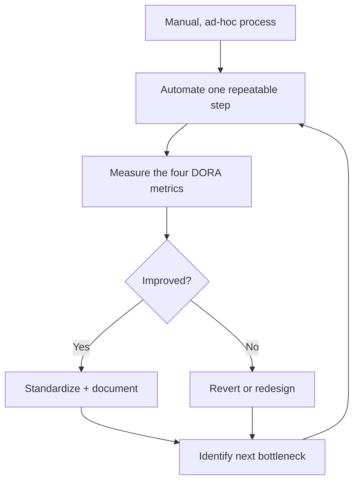

# Day 1, Module 1: DevOps Transformation

**Time allocation:** 1.0 hr
**OrderFlow-Lite tie-in:** None — this module is intentionally generic (maturity/DORA exercise). The case study starts in Module 2.

---

## A. Concept Note

### What DevOps Transformation Actually Means

"DevOps transformation" gets used to describe everything from renaming a
team to rewriting an entire delivery platform. Stripped of the buzzwords,
it means one thing: closing the gap between the people who write software
and the people who run it, so that the feedback loop between "we shipped
something" and "we know if it worked" gets shorter and more reliable.

A team that has transformed doesn't necessarily have more tools than one
that hasn't. It has fewer handoffs, fewer manual approval gates that exist
only because nobody trusts the automation, and a shared sense of ownership
for what happens after code merges — not just what happens before.

Transformation is not a single event. It's a maturity curve, and most
organizations sit somewhere in the middle of it: some automation exists,
but it's inconsistent, undocumented, or trusted only by the person who
built it. The rest of this course is about moving specific practices —
CI, containerization, orchestration, infrastructure as code, security
gates — further along that curve, one deliberate step at a time.

### Measuring It: The DORA Metrics

You can't manage what you don't measure, and "we feel more DevOps-y now"
isn't a metric. The DORA (DevOps Research and Assessment) program
identified four metrics that consistently separate high-performing
delivery teams from low-performing ones:

1. **Deployment Frequency** — how often code reaches production
2. **Lead Time for Changes** — time from commit to running in production
3. **Change Failure Rate** — % of deployments that cause a production issue
4. **Time to Restore Service** — how long it takes to recover from a failure

Two of these are speed metrics, two are stability metrics. The finding
that surprises people is that top performers are strong on *both* — speed
and stability are not a tradeoff you have to accept. Slow, careful teams
and fast, reckless teams are both underperforming; the best teams are fast
*because* they've made recovery cheap and reliable.

### Why It Matters in Production

Every module after this one in the course is, in DORA terms, an attempt to
move one of these four numbers. Jenkins CI shortens lead time by catching
problems before a human has to. Docker and Kubernetes shorten time to
restore by making rollback a command instead of a fire drill. DevSecOps
gates reduce change failure rate by catching known-bad patterns before
they ship. If you lose sight of why a practice exists, come back to these
four numbers and ask which one it's supposed to move.

### Diagram: The Transformation Loop



Transformation is this loop running continuously, not a project with an
end date.

---

## B. Worked Example: Calculating DORA Metrics for a Sample Team

This module doesn't yet have OrderFlow-Lite pipeline data to draw on —
Jenkins, Docker, and Kubernetes are built starting in Modules 3–5. Instead,
work through a small, realistic dataset by hand so the four metrics stop
being abstract definitions and become something you've actually computed.

**Sample data — Team "Fulfillment API," last 30 days:**

| Date | Event |
|---|---|
| Day 2 | Deploy #1 |
| Day 2 | Incident: deploy #1 caused a checkout timeout, resolved same day (4 hrs) |
| Day 9 | Deploy #2 |
| Day 14 | Deploy #3 |
| Day 14 | Incident: deploy #3 caused a data mismatch, resolved next day (18 hrs) |
| Day 21 | Deploy #4 |
| Day 27 | Deploy #5 |

Each deploy shipped a change that was committed, on average, 3 days before
deploy.

**Command / calculation, then output:**

```text
Deployment Frequency = deploys / time window
  = 5 deploys / 30 days
  = ~1 deploy every 6 days

Lead Time for Changes = avg(commit time -> deploy time)
  = 3 days (given)

Change Failure Rate = incidents / deploys
  = 2 / 5
  = 40%

Time to Restore Service = avg(incident resolution time)
  = (4 hrs + 18 hrs) / 2
  = 11 hrs
```

**What this means:** By DORA's four-tier benchmark bands, ~1 deploy/week
and a 3-day lead time land this team in the "medium" performer range — not
bad, but a 40% change failure rate is a red flag regardless of how fast
they ship. A team shipping less often with a lower failure rate would
actually be outperforming this one on the metric that matters most:
whether shipping is safe. This is the core insight to carry into the
lab — you cannot judge deployment frequency in isolation from failure rate.

---

## C. Hands-On Lab (45 min)

**Starting state:** No prior lab required — this is the first lab of the
course. You need a pen/whiteboard or a shared doc; no repo or terminal
access needed for this module.

### Step 1 — Individually, plot your own team (10 min)

On paper or a shared doc, estimate your own team's (or most recent team's)
values for all four DORA metrics, using rough numbers if exact ones aren't
known. Don't discuss yet — write it down first.

*You should see:* four numbers (or honest "I don't know" for each) written
down before any group discussion happens.

### Step 2 — Small groups, compare and classify (15 min)

In groups of 3–4, compare your numbers. Using the reference bands below,
classify each team member's org as Elite / High / Medium / Low on each of
the four metrics.

| Metric | Elite | High | Medium | Low |
|---|---|---|---|---|
| Deployment Frequency | On-demand (multiple/day) | Weekly–monthly | Monthly–biannually | Fewer than every 6 months |
| Lead Time | < 1 hour | 1 day – 1 week | 1 week – 1 month | > 1 month |
| Change Failure Rate | 0–15% | 16–30% | 16–30% | > 30% |
| Time to Restore | < 1 hour | < 1 day | 1 day – 1 week | > 1 week |

*You should see:* every group member has a 4-letter classification string
(e.g. "High / Medium / Low / High") and can point to which metric is the
weakest.

### Step 3 — Group discussion: pick one bottleneck (15 min)

As a group, agree on the single weakest metric across the group (the one
most people rated Low or Medium). Discuss and write down:

1. What's the *first* concrete practice that would move that number?
2. What would you have to measure to know if it worked?

*Success criterion:* each group produces one written sentence of the form:
"Our biggest bottleneck is ___, and the first thing we'd change is ___,
measured by ___." Be ready to share this with the room.

### Step 4 — Report out (5 min)

Each group shares their one sentence. The instructor will map each group's
answer to which upcoming module addresses it (e.g., "lead time" →
Jenkins/Docker modules; "change failure rate" → DevSecOps gates).

---

### Troubleshooting Checkpoint

- **"We don't track any of this."** — That's a valid and common answer.
  Write "unknown" rather than guessing a number that sounds good; the
  point of this exercise is honest baselining, not scoring well.
- **Confusing Change Failure Rate with bug count.** — It's specifically the
  % of *deployments* that cause a production issue, not total bugs filed.
  A team can have many minor bugs and a low change failure rate, or vice
  versa.
- **Treating deployment frequency as the only metric that matters.** — This
  is the most common mistake in the lab. Redirect groups back to the
  worked example: high frequency with high failure rate is not a win.

---

## D. Facilitator Notes

**Common failure points to watch for while circulating:**
- Groups tend to rush Step 1 and skip straight to group discussion — hold
  them to writing individual numbers first, since that's what surfaces
  genuine disagreement about what's actually happening on their team.
- Some participants will not know their org's real numbers at all. Don't
  let this stall the exercise — "unknown, and that itself is a finding"
  is a legitimate output.
- Watch for groups fixating on deployment frequency as a vanity metric.
  Use the worked example's 40% change-failure-rate team to redirect.

**Where this feeds into later modules:**
- The bottleneck each group identifies in Step 3 is a running thread —
  callback to it explicitly in Module 6 (AI-Assisted Pipeline Review) and
  again at Module 13 (Architecture Review and Closure), asking whether
  anything covered in the course would move their number.
- This module has no seeded issue of its own; it sets up the *measurement
  vocabulary* (deployment frequency, lead time, change failure rate, time
  to restore) that later facilitator notes reference when discussing what
  a given lab or seeded issue is meant to improve.

**No seeded issue for this module** — see `TRAINING_SEEDS.md` and
`CAPSTONE_FAILURE_GUIDE.md` in the OrderFlow-Lite repo for the two seeded
findings and the capstone failure, both introduced starting in later
modules.
