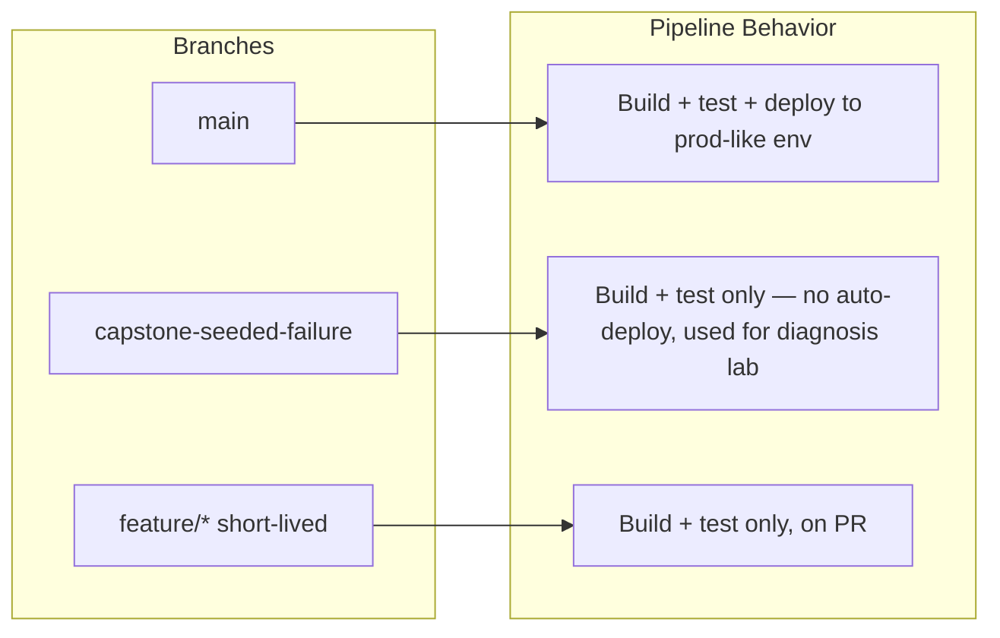

# Day 1, Module 2: CI/CD Design and Git

**Time allocation:** 1.0 hr
**OrderFlow-Lite tie-in:** Design the branching model actually used later in the course (`main` + `capstone-seeded-failure`)

---

## A. Concept Note

### Why Branching Strategy Is a CI/CD Decision, Not a Git Decision

Teams often pick a branching model — GitFlow, trunk-based, GitHub Flow —
as if it were a preference, like an editor theme. It isn't. Your branching
model *is* your CI/CD design, because every branch implies a pipeline
question: does this branch get built? Tested? Deployed? To where? A
branching strategy you can't answer those four questions for isn't a
strategy, it's just where commits happen to live.

The simplest model, trunk-based development, keeps one long-lived branch
(`main`) that is always deployable, with short-lived feature branches that
merge back quickly. It minimizes merge conflict surface and keeps CI
simple: one branch, one pipeline, one source of truth for "what's in
production." Its cost is discipline — nothing merges to `main` that isn't
ready to ship, because there's no staging branch to catch mistakes.

More elaborate models (GitFlow's `develop`/`release`/`hotfix` branches)
trade that simplicity for more control at each stage, at the cost of more
pipelines to maintain and more places for a change to get stuck in transit.
Neither is universally "correct" — the right choice depends on how often
you deploy and how much you trust your automated checks.

### What a Pipeline Needs From a Branch Model

Whatever model you pick, your CI/CD pipeline needs unambiguous answers to:

1. **Which branch is the source of truth for production?** (usually `main`)
2. **What triggers a build?** (every push? only PRs? only tags?)
3. **What triggers a deploy?** (merge to a specific branch? a manual gate?)
4. **How do special-purpose branches get treated?** (long-lived demo/training
   branches, hotfix branches — these often need explicit pipeline rules,
   not just implicit ones)

Question 4 matters more than it looks. Most pipeline designs are built
assuming only "trunk" and "short-lived feature branch" exist, and then
break — or silently do the wrong thing — the first time a branch doesn't
fit that assumption.

### Why It Matters in a Production Context

A pipeline that can't answer "what does a push to *this* branch do?" in
one sentence is a pipeline nobody trusts, and a pipeline nobody trusts gets
bypassed manually — which is how untested changes reach production. Every
later module in this course (Jenkins, Docker, Kubernetes deploy) will build
one rule at a time on top of the branch model you design in this module,
so an ambiguous answer here becomes rework later.

### Diagram: Branch → Pipeline Trigger Mapping



---

## B. Worked Example: The Real OrderFlow-Lite Branches

OrderFlow-Lite doesn't have a Jenkinsfile yet — that's built in Module 3.
What it already has, right now, is the actual branch structure you'll
design a policy for. Inspect it directly.

**Command:**

```bash
cd orderflow-lite
git branch -a
```

**Output:**

```text
* main
  capstone-seeded-failure
```

**Command:**

```bash
git log --all --oneline
```

**Output:**

```text
db18fe4 Add CLAUDE.md to .gitignore files in root and orderflow-lite directories
bb6a303 Add trainer-only guide for capstone ConfigMap key mismatch lab
0d62122 SEEDED: configmap key mismatch for capstone lab
ae95f86 Add Kubernetes manifests for OrderFlow-Lite deployment and MySQL setup
89f8051 Seed known Trivy/GitLeaks findings for training labs
1aacd07 Add OrderFlow-Lite: Express + MySQL order API with background worker
```

**Command:**

```bash
git diff main capstone-seeded-failure --stat
```

**Output:**

```text
 orderflow-lite/CAPSTONE_FAILURE_GUIDE.md | 166 +++++++++++++++++++++++++++++++
 orderflow-lite/k8s/configmap.yaml        |   2 +-
 4 files changed, 167 insertions(+), 3 deletions(-)
```

**What this means:** OrderFlow-Lite uses a deliberately minimal, two-branch
model — not textbook trunk-based development, and not GitFlow. `main` is
the single source of truth: everything you build in Modules 3–10 targets
`main`. `capstone-seeded-failure` is a long-lived *divergent* branch that
exists only to carry one intentional break (visible in the `configmap.yaml`
diff — a one-line key rename) plus its own diagnostic guide, so Module 11's
capstone has something real to debug. It is never meant to merge back into
`main`. This is the fourth question from the concept note in practice: a
special-purpose branch that needs an explicit pipeline rule ("build and
test, never auto-deploy") rather than being treated like a normal feature
branch.

---

## C. Hands-On Lab (35 min)

**Starting state:** A local clone of the OrderFlow-Lite repo with both
`main` and `capstone-seeded-failure` branches present (from the worked
example above). No CI/CD tooling required yet — Jenkins arrives in
Module 3.

### Step 1 — Inspect both branches yourself (10 min)

Run the three commands from the worked example yourself, then also run:

```bash
git diff main capstone-seeded-failure -- k8s/configmap.yaml
```

*You should see* a two-line diff renaming `WORKER_POLL_INTERVAL_MS` to
`WORKER_POLLING_INTERVAL_MS` — don't try to diagnose or fix it now, that's
Module 11. Just confirm you can find and read a diff between two branches.

### Step 2 — Answer the four pipeline questions, in writing (15 min)

In pairs, write one sentence each for OrderFlow-Lite answering:

1. Which branch is the source of truth for production?
2. What should trigger a build?
3. What should trigger a deploy?
4. What should happen when `capstone-seeded-failure` is pushed to?

*Success criterion:* four written sentences, and specifically for Q4, an
answer that is **not** "same as main" — you should be able to say in one
sentence why that branch needs different treatment (hint: it exists
permanently to hold a broken state on purpose).

### Step 3 — Draw the branch → pipeline mapping (10 min)

Using the mermaid diagram in the concept note as a template, redraw it
using your own Step 2 answers instead of the example's generic labels.
Keep it to branches that actually exist in the repo right now — don't
invent a `develop` or `release` branch that OrderFlow-Lite doesn't have.

*Success criterion:* a diagram (whiteboard or shared doc) with exactly two
branches and one pipeline-behavior box per branch, matching your Step 2
answers.

---

### Troubleshooting Checkpoint

- **Trying to design a full GitFlow model.** — This repo intentionally
  doesn't use one. If your diagram has more than two branches, you've
  designed a hypothetical system, not OrderFlow-Lite's. Scale back.
- **Treating `capstone-seeded-failure` as a feature branch that will merge.**
  — It won't, and shouldn't. Re-read the worked example's explanation: it's
  a permanent, divergent branch built to hold a specific broken state for
  a later lab.
- **`git diff main capstone-seeded-failure` run from the wrong directory.**
  — Must be run from inside `orderflow-lite/`, not the repo root, or from
  wherever your local clone's working directory is; if it returns nothing,
  confirm both branches exist locally with `git branch -a` first.

---

## D. Facilitator Notes

**Common failure points to watch for while circulating:**
- Pairs often default to describing GitFlow from memory instead of looking
  at what's actually in the repo — redirect them to Step 1's actual `git
  diff` output before they write Step 2's answers.
- Q4 is the one most pairs get wrong on the first pass, answering "same
  build/test pipeline, but no deploy" without articulating *why*. Push for
  the one-sentence justification, not just the rule.

**Where this feeds into later modules:**
- The four answers written in Step 2 are the actual design constraints
  Module 3 (Jenkins) will implement as real pipeline stages — call this
  back explicitly when introducing the Jenkinsfile.
- The `capstone-seeded-failure` branch and its `configmap.yaml` diff,
  observed here without explanation, is the exact artifact Module 11's
  capstone lab asks trainees to diagnose using
  `CAPSTONE_FAILURE_GUIDE.md`. Do not explain the symptom or fix now — this
  module is strictly "notice the branch exists and diverges," not
  "diagnose why."
- No seeded Trivy/GitLeaks issue is relevant to this module; those surface
  starting in Module 4. See `TRAINING_SEEDS.md` in the OrderFlow-Lite repo.
