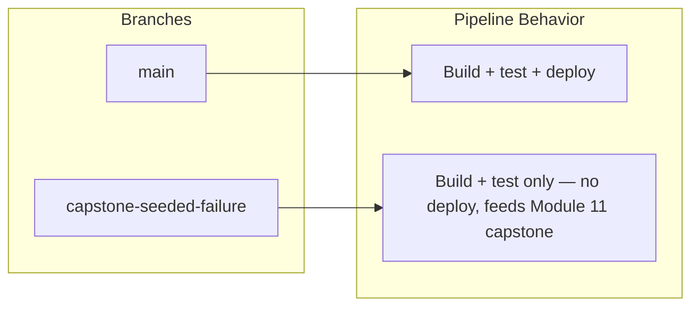

# Day 1, Module 2 - Live Demo Script + Solution
### Branch → Pipeline Design, Built From Scratch

**Purpose:** Run this live in front of the room *before* trainees start
their own Step 1–3 lab exercise (see `day1-02-cicd-design-git.md`).
Trainees follow along on their own clone as you run each command, filling
in their own copy of the four-question worksheet as you build it. This
script also doubles as the answer key — Section 2 ("Solution") is what
the room's answers should converge toward.

**Materials:** a terminal with the OrderFlow-Lite repo cloned, projected;
trainees follow along on their own clones. No Jenkins/Docker/Kubernetes
needed yet.

**Time:** ~12 minutes, run before Step 1 of the hands-on lab.

---

## 1. Live Demo Script

Narrate this out loud, running each command live rather than describing
it — don't reveal the finished four-question worksheet up front. The point
is that trainees watch the branch model get *inspected and reasoned
about*, not just handed to them as a diagram.

### 1.1 — Start from "what branches actually exist" (2 min)

Say: *"We're not going to start from a textbook branching model. We're
going to start from what's actually sitting in this repo right now, and
design a policy that fits it — not the other way around."*

Run, projected:

```bash
cd orderflow-lite
git branch -a
```

Expected output:

```text
* main
  capstone-seeded-failure
```

Say: *"Two branches. Not three, not five. Whatever we design in the next
ten minutes has to explain both of these — no more, no less."*

### 1.2 — Look at the commit history together (2 min)

Run:

```bash
git log --all --oneline
```

Expected output:

```text
db18fe4 Add CLAUDE.md to .gitignore files in root and orderflow-lite directories
bb6a303 Add trainer-only guide for capstone ConfigMap key mismatch lab
0d62122 SEEDED: configmap key mismatch for capstone lab
ae95f86 Add Kubernetes manifests for OrderFlow-Lite deployment and MySQL setup
89f8051 Seed known Trivy/GitLeaks findings for training labs
1aacd07 Add OrderFlow-Lite: Express + MySQL order API with background worker
```

Say: *"Read the commit right above the bottom one — 'Seed known
Trivy/GitLeaks findings.' Read the top two — 'SEEDED: configmap key
mismatch' and 'trainer-only guide for capstone.' Those top two commits
only exist on one of our two branches. Which one, and why would someone
deliberately keep that branch separate instead of merging it in?"*

Let the room guess before moving on — don't answer yet.

### 1.3 — Reveal the divergence with a real diff (3 min)

Run:

```bash
git diff main capstone-seeded-failure --stat
```

Expected output:

```text
 orderflow-lite/CAPSTONE_FAILURE_GUIDE.md | 166 +++++++++++++++++++++++++++++++
 orderflow-lite/k8s/configmap.yaml        |   2 +-
 4 files changed, 167 insertions(+), 3 deletions(-)
```

Say: *"166 lines of a new guide file, and a 2-line change to a Kubernetes
config file. Let's see the 2-line change — that's the interesting one."*

Run:

```bash
git diff main capstone-seeded-failure -- k8s/configmap.yaml
```

Expected output:

```text
-  WORKER_POLL_INTERVAL_MS: "5000"
+  WORKER_POLLING_INTERVAL_MS: "5000"
```

Say: *"One renamed key. We are not diagnosing this today — that's Module
11's capstone. Today, the only thing that matters is: this branch
contains a deliberate divergence from main, on purpose, and it is never
going to merge back. What does that mean for how our pipeline should treat
a push to this branch, versus a push to main?"*

### 1.4 — Build the four-question worksheet live (4 min)

Draw a blank four-row table on the board: **Question | Answer**. Fill it
in with the room's input, landing on the reference answers below — don't
just write the final answers, let trainees propose the first pass and
correct in real time.

Say for Q4 specifically: *"This is the one people get wrong. 'Same as
main but skip deploy' isn't a full answer — you have to say *why*. Why
does a permanently-diverged branch need a different rule than a
short-lived feature branch would?"*

Push the room toward: *"because it exists to hold a broken state on
purpose, for a later diagnostic exercise — not because someone forgot to
merge it."*

### 1.5 — Hand off to the lab (1 min)

Say: *"You just watched me answer these four questions for OrderFlow-Lite
by reading the repo, not by guessing. Now do the same thing yourselves in
pairs — Step 1 of your handout is exactly what we just ran. Step 2 is the
worksheet you just watched me fill in — do it again yourselves, in your
own words, then compare with a partner."*

---

## 2. Solution / Answer Key

Use this to check trainee work during Steps 2–3 of the lab, and to
self-check your own live-demo board matches before you run it.

### 2.1 — Branch inventory (from Step 1.1)

| Branch | Status |
|---|---|
| `main` | trunk — always the deployable source of truth |
| `capstone-seeded-failure` | permanent, intentionally divergent — holds one seeded break for Module 11 |

### 2.2 — The four pipeline questions, reference answers

| # | Question | Reference Answer |
|---|---|---|
| 1 | Which branch is the source of truth for production? | `main` — every module from Jenkins onward targets it |
| 2 | What should trigger a build? | Every push to `main`, and every push to `capstone-seeded-failure` (build/test only) |
| 3 | What should trigger a deploy? | A successful build+test on `main` only |
| 4 | What happens on a push to `capstone-seeded-failure`? | Build and test run, but **no deploy** — the branch exists permanently to hold a broken config for a later diagnostic lab, not to ship; treating it like a normal feature branch (assume it merges soon) would be wrong |

A trainee answer to Q4 that says only "no deploy" without the *why* is
incomplete — push for the justification, not just the rule, per the
concept note's framing.

### 2.3 — Reference branch → pipeline diagram



A correct trainee diagram should have exactly these two branches and two
outcome boxes — no invented `develop`, `release`, or `hotfix` branches.
More branches than the repo actually has is the most common Step 3
mistake; redirect back to Step 1.1's `git branch -a` output.

---

## 3. Facilitator-Only Notes on Running This Demo

- Do **not** reveal the `k8s/configmap.yaml` diff before running the
  commands live — the pause after "let's see the 2-line change" is
  deliberate, it's what makes trainees actually read the output instead of
  skimming past it.
- If someone asks what `WORKER_POLL_INTERVAL_MS` vs
  `WORKER_POLLING_INTERVAL_MS` actually breaks, explicitly defer: *"Great
  question, that's the entire point of Module 11 — hold onto it."* Do not
  explain the mechanism now, per the module's own facilitator notes.
- If a trainee proposes deleting `capstone-seeded-failure` after seeing the
  diff ("shouldn't we just fix and merge this?"), use it as a teaching
  moment: some branches exist for a purpose other than merging — training,
  demo, reference — and a good branch policy has to name that explicitly
  rather than assuming every branch is headed for `main` eventually.
- This script assumes ~12 minutes with a live terminal. If typing/waiting
  eats time, project pre-run output instead of running commands live for
  Steps 1.2–1.3, but keep Step 1.1 (`git branch -a`) live — it's the
  cheapest command and sets up the "only two branches" framing everything
  else depends on.
